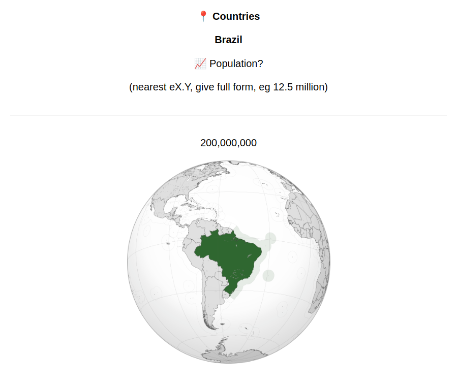
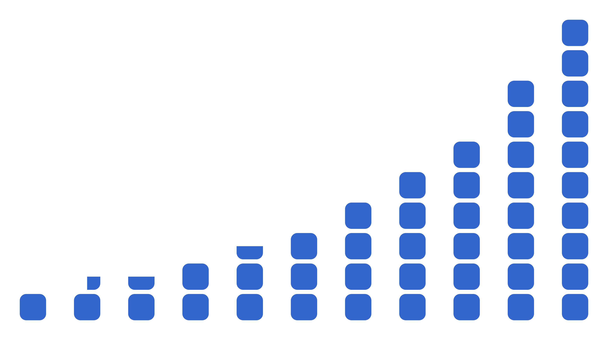

# Fligits: Nice round numbers

Imagine I want to learn the countries of the world. I'll use flash cards for their names, locations, capitals.... and also their populations.

What's the population of Switzerland? Worldometer says 8,998,204. Should I memorize that number?

Oops, now it's 8,998,205. Should I memorize *that* number?

Obviously, the exact number of people is too specific. I don't care about the difference between 8,998,204 and 8,998,205, or between that and 8,998,000, or even between that and 9,000,000. For these flash cards, I want to **approximate** the population using a **round number.**

**But what exactly are the "round numbers"?**

## What is a round number?

Let's say the "round numbers" are:

1, 2, 3, 4, 5, 6, 7, 8, 9,

10, 20, 30, 40, 50, 60, 70, 80, 90,

100, 200, 300, 400, 500, 600, 700, 800, 900... and so on.

So Switzerland's population (which is 8,998,000) is 9,000,000. And Togo's population (which is 9,930,918) is 10,000,000, and Honduras (which is 11,184,760) is 10,000,000 again. These are pretty good approximations, only wrong by a few percent each.

Rwanda's population is 14,889,693. The nearest round number is 10,000,000. So I'm underestimating Rwanda's population by 4,889,693, which is nearly a third.

Benin's population is 15,170,419. The nearest round number is now 20,000,000, which overestimates Benin by 4,829,581, also wrong by nearly a third. And if I try to round these the other direction (Rwanda up to 20,000,000 and Benin down to 10,000,000) they're both even more wrong. There's no way to win with these 15,000,000s.

## Unfair gaps

If your population is like 7,000,000 or 8,000,000 or 9,000,000 or 10,000,000, these round numbers serve you very well. There's always a round number nearby. Even if you're exactly between two round numbers, like 7,500,000, you can approximate as one of them (7,000,000) and it's still very close (in this case 7%, which is a good enough approximation for me).

But if your population is like 15,000,000, the distance is much larger. For example 14,999,999 gets rounded to 10,000,000 which is 33% smaller than the original number. That's too big of a difference.

The problem is these gaps between the round numbers. The gap from 7,000,000 to 8,000,000 is a 14% increase. From there to 9,000,000 is a 12% increase. From there to 10,000,000 is an 11% increase. Then the next round number is 20,000,000, an increase of 100%.

And this happens again at every power of 10: there's a 7, slight step up to an 8, slight step up to a 9, slight step up to a 1, then the next step is a complete doubling to get to a 2. Any number like 1.5 (or 15 or 150...) will be in the middle of a super-wide gap and will be unreasonably far from the nearest round numbers, 1 and 2 (or 10 and 20, or 100 and 200...).

## Fair gaps

Ideally, all these gaps would be the same percent increase.

Let's assume we want to keep 1, 10, 100, 1000 etc as round numbers. And I think it makes sense to have 10 steps between each power of 10, like we had before using 1-9, 10-90, etc.

Ten equal steps from 1 to 10 must be steps of 10^(1/10), which is about 1.2589. By starting at 1, then increasing by a factor of 1.2589 (that is, adding 25.89%) ten times, we'll take ten equal steps to land at 10.

So our round numbers are the powers of 1.2589:

1, 1.2589, 1.5849, 1.9953, 2.5119, 3.1623, 3.9811, 5.0119, 6.3096, 7.9433,

10, 12.5893, 15.8489, 19.9526, 25.1189, 31.6228, 39.8107, 50.1187, 63.0957, 79.4328,

100, 125.8925, 158.4893, 199.5262, 251.1886, 316.2278, 398.1072, 501.1872, 630.9573, 794.3282... and so on

Now the gaps are perfectly fair!

Rwanda's 14,889,693 people are rounded to the 73rd round number, which is 15,848,932, which is only wrong by 6%.

But should I write on my flash card that Rwanda is home to "approximately 15,848,932 people" and try to memorize that? I'm never going to remember all those digits, and they don't even matter. The whole point of this is that I don't care about the difference between 15,848,932 and 15,849,823 and so on.

These new "round numbers" aren't actually **round** at all. We want **equal gaps**, but we also want **memorable** numbers.

## Memorable numbers

15,848,932 is about 15,000,000. Let's just adjust that step from 1.5849 to 1.5. That's only different by a few percent, and it's much easier to remember.

We can adjust all these steps to nearby memorable numbers. Here's how I adjust the steps:

1, 1.25, 1.5, 2, 2.5, 3, 4, 5, 6, 8,

10, 12.5, 15, 20, 25, 30, 40, 50, 60, 80,

100, 125, 150, 200, 250, 300, 400, 500, 600, 800... and so on

It's lucky that several of the powers of 10^0.1 work so hard to be close to round numbers, like 10^0.3 being 1.9953. The adjustments here are all small ones:

| Power of 10^0.1 | Adjustment | Adjusted number |
| --------------- | ---------- | --------------- |
| 1               | +0%        | 1               |
| 1.2589          | -0.7%      | 1.25            |
| 1.5849          | -5.4%      | 1.5             |
| 1.9953          | +0.2%      | 2               |
| 2.5119          | -0.5%      | 2.5             |
| 3.1623          | -5.1%      | 3               |
| 3.9811          | +0.5%      | 4               |
| 5.0119          | -0.2%      | 5               |
| 6.3096          | -4.9%      | 6               |
| 7.9433          | +0.7%      | 8               |

So these adjustments are modest, only about 5% at their biggest, typically less than 1%, and look how much memorableness this buys us! One, one and a quarter, one and a half, two, two and a half, three, four, five, six, eight, done. These are fine smooth amounts you can hold in your hand and walk around with.

These amounts (1, 1.25, 1.5, 2, 2.5, 3, 4, 5, 6, 8) are like the **digits** (1, 2, 3, 4, 5, 6, 7, 8, 9) except they are equally spaced on an exponential scale (10^0.0, 10^0.1, 10^0.2, 10^0.3, 10^0.4, 10^0.5, 10^0.6, 10^0.7, 10^0.8, 10^0.9). This is similar to **floats** in computer science, which approximate numbers using an equal number of steps between 1 and 10, and between 10 and 100, and so on. Therefore I call these amounts **fligits.**

## Fligit gaps

I just adjusted these numbers to be more memorable. Are the gaps still fair?

| Fligit | Gap  | Next fligit |
| ------ | ---- | ----------- |
| 1      | +25% | 1.25        |
| 1.25   | +20% | 1.5         |
| 1.5    | +33% | 2           |
| 2      | +25% | 2.5         |
| 2.5    | +20% | 3           |
| 3      | +33% | 4           |
| 4      | +25% | 5           |
| 5      | +20% | 6           |
| 6      | +33% | 8           |
| 8      | +25% | 10          |

The smallest gaps are a 20% increase, and the largest gaps are a 33% increase. Not perfectly equal, but much better than the 11% and 100% we had before.

And are the gaps small enough?

In the old system, the largest gaps (between 1 and 2, between 10 and 20, between 100 and 200, etc) were steps of 100%, and we had to deal with approximations that were wrong by 33% (like saying 14,999,999 is 10,000,000).

With fligits, the largest gaps (between 1.5 and 2, between 3 and 4, between 6 and 8, etc) are only 33%, and the worst case is a number in the middle of one of these gaps, for example Peru's population (which is 34,922,148) is approximated as 30,000,000 which is about 15% too low.

So fligits cut the maximum error by better than half, from 33% to 15%. If you feel that 6 and 7 are approximately equal, then fligits can approximate any number.

## Success!

So now I actually use fligits for estimating country populations: as far as my flash cards are concerned, the population of Switzerland is 10,000,000, and the populations of Rwanda and Benin are both 15,000,000. All of these are guaranteed to be within 15%, which if anything is possibly *more* precise than I really need.

I use fligits for other memorization stuff too.

- Population rank: I care that Benin is roughly the 80th most populous country, but I don't care that it is the 76th most populous country.
- Currencies: I care that about ¥150 is $1, but I don't care that exactly ¥159.54 is $1.
- Other units: it's nice to know that a year is about 8,000 hours, but I don't care that it's 8,760 hours.

More importantly, I don't want to make decision after decision about the proper approximation of each number. "Let's see, a dollar is 159.54 yen. I guess I'll round to 160. Or is 150 more round? Come to think of it, I might only need to know it's near 200. But 160 is so much more accurate..." Anything like this, I can now skip directly to fligits and know that it's a single, definitive, memorable system that's always accurate within 15%.

Success!

That said, there are a few extra, optional benefits of fligits that I'd like to mention.

### Fligits are powers of 10^0.1

Fligits started as powers of 10^0.1. As a result, the fligits are very close to this convenient series:

10^0.0, 10^0.1, 10^0.2, 10^0.3, 10^0.4, 10^0.5, 10^0.6, 10^0.7, 10^0.8, 10^0.9,

10^1.0, 10^1.1, 10^1.2, 10^1.3, 10^1.4, 10^1.5, 10^1.6, 10^1.7, 10^1.8, 10^1.9,

10^2.0, 10^2.1, 10^2.2, 10^2.3, 10^2.4, 10^2.5, 10^2.6, 10^2.7, 10^2.8, 10^2.9, and so on

So approximating a number as a fligit essentially means taking the log base 10 and rounding that to one decimal place. For example the population of Benin is 15,170,419, log10 of that is 7.181..., which rounds to 7.2, so Benin has about 10^7.2 people, which fligits call as 15,000,000.

In fact, when I convert numbers to fligits I always use this log10-and-round method rather than doing math to figure out if (for example) 13,840 is closer to 12,500 or 15,000. This makes fligits convenient with computers and spreadsheets, where I can just use the formula 10^(round(log10(X))).

Fligits being powers of 10^0.1 naturally leads to fligits less than 1. For example 10^-3.8 is 0.0001585... and this looks a lot like 0.00015, which is not a coincidence, because 10^-3.8 is equal to 10^-4 times 10^.2, which is 0.0001 times the fligit 1.5. Better yet, 10^-3.8 is also simply 1 / 10^3.8, which is 1 over the fligit 6,000, so we could also call 0.00015 as 1/6000, which is accurate within 10%.

Fligits being powers of 10^0.1 also lends them to easy rough mental math. What's 8,226 times 17,800?

>  8,226 is close to 8,000 which is 10^3.9.
>
> That's a little too low so I'll round 17,800 up to 20,000 which is 10^4.3.
>
> Multiplying these means adding their exponents: 10^(3.9 + 4.3) is 10^8.2 is 150,000,000.

Real answer: 146,422,800. Estimate was wrong by: 2.5%.

### Fligits are nice numbers

Besides these functional properties, I find fligits just pleasant numbers in general.

They start at 1, then step up by a quarter, a quarter, a half, a half, a half, 1, 1, 1, 2, 2, and then it restarts at 10.

You might have noticed a pattern in the percent gaps between fligits (25%, 20%, 33%, 25%, 20%, 33%, 25%, 20%, 33%, 25%). That's because fligits themselves follow a very simple pattern: it's 4 quarters, 5 quarters, 6 quarters, 4 halves, 5 halves, 6 halves, 4 units, 5 units, 6 units, 4 twos, 5 twos, and then repeat.

Or to look at it differently, it's 4 quarters, 5 quarters, 3 halves, 4 halves, 5 halves, 3 units, 4 units, 5 units, 3 twos, 4 twos, 5 twos.

Finally, even if we strip away all this theoretical explanation, and mathematical properties, and everything I've talked about, still everyone already understands fligits as round numbers. You can just say a mile is 5,000 feet, or the Earth is 12,500,000 miles wide, or the Vatican is home to 800 people, and no one needs a 2,000 word essay to see why that makes sense.